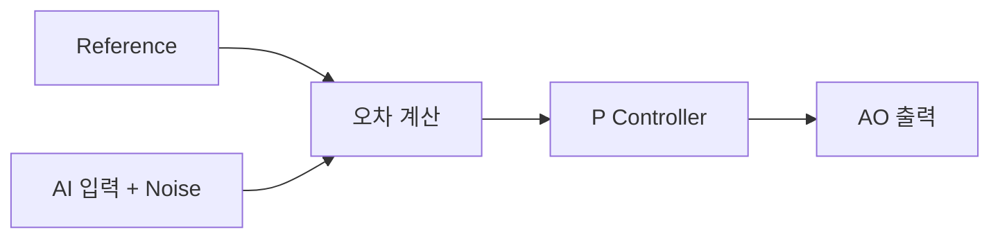

## 📘 DAQ 기반 실시간 P 제어 + 노이즈 실험 정리
### 🎯실험 목적
DAQ 장비를 사용하여 간단한 폐루프 제어 시스템을 구성
1. 기준 신호(Reference) 생성
2. 아날로그 입력 읽음
3. 측정값에 노이즈를 인위적으로 추가
4. P 제어를 통해 보정값 계산
5. 아날로그 출력으로 다시 인가
6. 기준/입력/출력을 동시에 비교  
이후 FPGA에 수행할 제어 로직을 미리 검증하는 단계
### 🎯시스템 구성

그리고 AO0 -> A10를 물리적으로 연결하여 출력이 다시 입력으로 돌아오는 폐루프 (closed loop) 구조를 만든다
### 🎯사용 채널
- 입력: Dev3/ai0
- 출력: Dev3/ao0
- 전압 범위: 10V
### 🎯코드 동작 흐름
기준 생성 → 전압 읽기 → 노이즈 추가 → 오차 계산 →
P 제어 → 출력 → 그래프 업데이트
### 📌 1. 기준 신호 (Reference)
- Step: 일정 시간 이후 특정 값으로 점프
- Sine: 시간에 따라 사인파 생성
```python
setpoint = SINE_AMP * np.sin(2*np.pi*SINE_FREQ*t)
```
### 📌 2. 입력 읽기 (Measurement(
```python
sensor = ai.read()
```
### 📌 3. 노이즈 추가
```python
noise = np.random.normal(0.5, NOISE_STD)
sensor_noisy = sensor + noise
```
의미: 실제 시스템에서는 센서가 완벽하지 않기 때문에 측정값에는 항상 오차나 잡음이 포함된다. 이를 인위적으로 만들어 제어기가 방해를 받는 상황을 재현한다.

**파라미터**
- 0.5 : 평균 오프셋
- NOISE_STD : 랜덤 노이즈 크기

### 📌 4. P 제어
```python
error = setpoint - sensor_noisy
output = sensor_noisy + kp * error
```
의미: 현재 값이 목표에서 얼마나 떨어져 있는지 계산하고, 그 차이에 비례해서 보정한다.

**kp**
- 크면 빠르게 따라가지만 진동 가능
- 작으면 안정적이지만 느림

### 📌 5. 출력
```python
ao.write(output)
```
계산된 제어 전압을 실제 장비로 보낸다. 
### 📌 6. 실시간 그래프
- Reference: 목표
- Input: 노이즈 포함 현재 상태
- Output : 제어기가 만든 보정 결과
  
### 🎯확인 가능한 것
- 폐루프가 정상 동작하는지
- 제어 출력이 목표를 향해 수렴하는지
- noise가 있을 때 얼마나 흔들리느지
- kp 값이 성능에 어떤 영향을 주는지 
  
